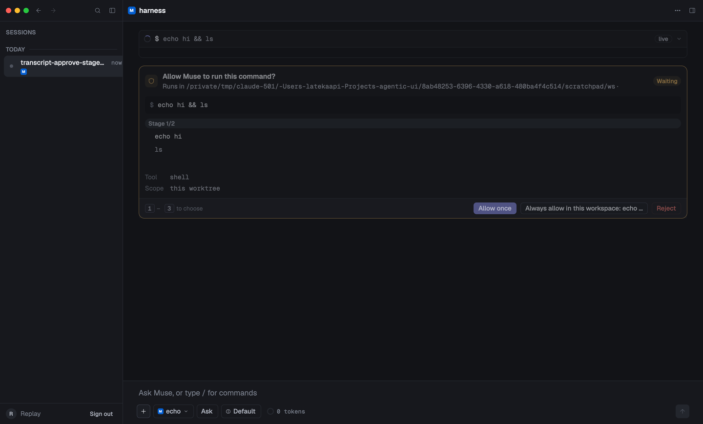

# Harness

A macOS chat interface to Meta's **Muse Code** agent, built on the
[`aui`](../agentic-ui) component library and gpui.

The `muse` CLI ships a TUI. This is the same agent with a window around it: a
sessions sidebar on the left, a streaming transcript and a docked composer in
the centre, and every card the agent can raise — approvals with the server's own
choices, questions with previews and a timeout, plans, todos, tool output,
errors with retry — drawn rather than printed.



## Running it

```sh
export PATH="/opt/homebrew/bin:$HOME/.cargo/bin:$HOME/.local/bin:$PATH"

cargo run -p harness                                    # workspace = $PWD
cargo run -p harness -- --workspace ~/code/thing        # somewhere else
cargo run -p harness -- --replay fixtures/msp/transcript-approve.jsonl   # free
cargo run -p harness -- --print-tier                    # which plan is this login on?
```

It drives `muse serve` as a child process and speaks MSP — JSON-RPC 2.0 as
NDJSON over stdio. You need the `muse` CLI on your `PATH` and a login; the app
signs you in the way the CLI does (device code), and the window is otherwise
the whole interface.

`agentic-ui` must be checked out **beside** this repository, on branch
`muse-support`: the `aui` crates are path dependencies.

## What a turn costs

Read this before running anything scripted.

**There is no free provider.** `--provider echo` picks a *route*, not a bill: on
a signed-in machine the session log records `provider_id: echo` at intake and
then a metadata record naming `provider_id: meta` with a real model, and the
turn bills reasoning tokens like any other. What genuinely costs nothing is
`--replay <capture>`, which folds a checked-in wire capture with no server at
all; `--no-connect`, which draws the chrome without one; and, on a live server,
`session/start`, `session/userShell` (the `!` path), `approval/*`,
`userInput/*`, `session/fork`, `session/list` and `view/page` — none of which
make a model call. Anything that reaches `turn/start` spends a turn. **And what
that turn costs depends on the login**: Muse issues credentials on two tiers,
and a pay-as-you-go token bills every turn as API usage. The harness probes the
tier and refuses to send on pay-as-you-go until you say so once
(`docs/06-billing.md`).

## Documentation

| file | what it covers |
|---|---|
| `docs/00-spec.md` | the frozen spec: scope, decisions, the five phases and their gates |
| `docs/01-transport.md` | MSP over stdio: framing, the handshake, reconnect |
| `docs/02-app.md` | the application: entities, auth, the sidebar, the shell |
| `docs/03-composer.md` | the composer's controls, menus and pickers |
| `docs/04-approvals.md` | approvals, questions, errors, `--replay` — **§0 first** |
| `docs/06-billing.md` | the two credential tiers, the probe, and the guard |
| `docs/07-architecture.md` | the crates, the thread model and the fold |
| `docs/08-keymap.md` | every key, as built |
| `docs/05-handoff.md` | maintenance: where things are and what to be careful of |
| `docs/CHANGELOG.md` | what each phase landed, and what it spent |

## Layout

```
crates/muse-client    the transport and the typed MSP schema
crates/muse-adapter   MuseFold: MSP events → aui_protocol deltas
crates/harness        the gpui application
fixtures/msp          checked-in wire captures; every one of them replays
```

## Licence

MIT.
