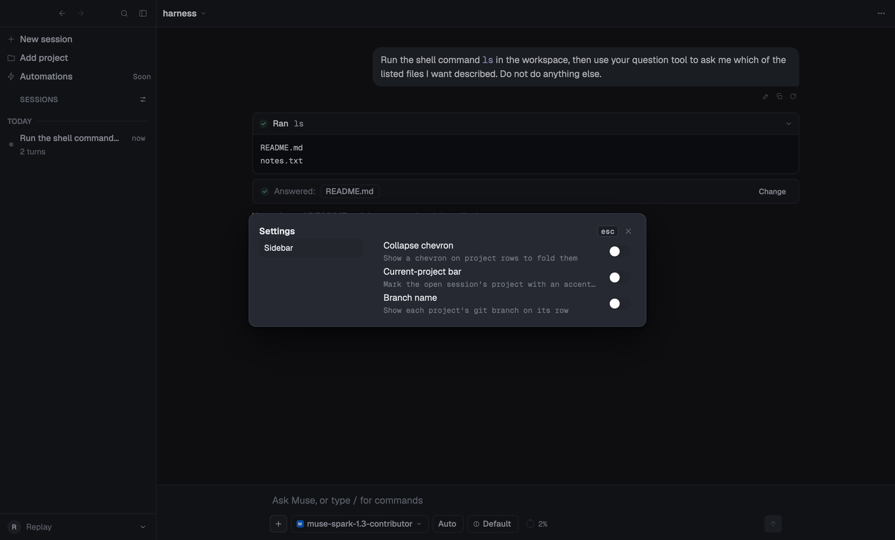

# Baaz

A native macOS chat client for Muse Code —
built with [gpui](https://www.gpui.rs) (the UI framework behind
[Zed](https://zed.dev)) and the `aui` component library.

The `muse` CLI ships a terminal UI. This is the same agent with a window
around it: a projects-and-sessions sidebar on the left, a streaming
transcript and a docked composer in the centre, and every card the agent can
raise — approvals with the server's own choices, questions with previews and
a timeout, plans, todos, tool output, errors with retry — drawn rather than
printed.

<p>
  
  
</p>
<p>
  
  
</p>

## What it does

- **Chat over Muse Code.** Drives `muse serve` as a child process and speaks
  MSP (JSON-RPC 2.0 as NDJSON over stdio); signs in the way the CLI does
  (device code or an API key).
- **A streaming transcript** with markdown, reasoning, and tool calls folded
  into readable cards, per-turn token counts, a context meter with
  compaction, and a queue strip for steering a running turn.
- **Approvals, questions and errors** as real UI: multi-stage approval cards
  with the server's own choices, question cards with previews and a timeout,
  error banners with retry, plans and todos.
- **Projects** — a sidebar over several workspaces at once, grouped by
  project or by date, with per-project pinning, colour, and model/effort/
  approval defaults.
- **Sessions**: resume, rename, fork, archive; a draft (text, images, files)
  kept per project; a full-text search palette over transcripts and the
  files a turn created.
- **A composer** with model, effort and mode menus, `@`-mentions, a
  `/`-command menu (including skills from `muse skills list`), prompt
  history, and image attachments.
- **Billing-tier awareness.** Baaz probes which plan a login is on and
  warns before a turn would bill pay-as-you-go, rather than finding out
  after the fact (see **Cost**, below).
- **Session rows that explain themselves.** Every row is title, status verb,
  context: `Working · 14m`, `Needs approval`, `Asked: "…"`, `Settled · 12m`,
  `Failed · 1h`. Titles are generated on the first send; hovering a row
  opens the full picture in a detail card that never steals focus.
- **A transcript you can read and reuse.** Cross-block text selection with
  copy, per-turn timestamps (`just now` … `yesterday`), copy buttons that
  confirm, file paths and links that open, and a status line that names the
  turn's current phase instead of just spinning.
- Both light and dark themes, a command palette, and a keyboard-first keymap.

## Requirements

- **macOS 14 (Sonoma) or later.**
- **Rust 1.85+** and the Xcode command line tools (`xcode-select --install`).
- The **`muse` CLI** on your `PATH`, signed in to a Muse Code account.
  Baaz currently targets muse's 1.3.x wire schema (MSP).
- The [`aui`](https://github.com/latekaapi/agentic-ui) component library,
  checked out **beside** this repository — it's a path dependency for now
  (see `Cargo.toml`).

## Building and running

```sh
git clone https://github.com/latekaapi/baaz
git clone https://github.com/latekaapi/agentic-ui   # beside it, not inside it

cd baaz
cargo run -p baaz                               # workspace = $PWD
cargo run -p baaz -- --workspace ~/code/thing    # somewhere else
```

A distributable `.app` bundle:

```sh
scripts/bundle.sh                    # builds target/bundle/Baaz.app
open target/bundle/Baaz.app
```

## Cost — read this before running anything scripted

**There is no free provider.** `--provider echo` picks a *route*, not a
bill: on a signed-in machine, anything that reaches `turn/start` spends a
turn, and what that turn costs depends on which plan the login is on —
Muse issues credentials on two tiers, and a pay-as-you-go token bills every
turn as API usage. Baaz probes the tier and warns before sending on
pay-as-you-go.

What costs nothing:

```sh
cargo run -p baaz -- --replay fixtures/msp/transcript-approve.jsonl   # a checked-in capture, no server at all
cargo run -p baaz -- --no-connect                                     # draws the chrome, no server
cargo run -p baaz -- --print-tier                                     # which plan is this login on?
```

See `docs/06-billing.md` for the full picture, and `CONTRIBUTING.md` for the
rest of the scripting surface (`--steps`, `--screenshot`, and which step
verbs spend a turn).

## Documentation

| file | what it covers |
|---|---|
| `docs/00-spec.md` | the frozen spec: scope, decisions, and the build's phases and gates |
| `docs/01-transport.md` | MSP over stdio: framing, the handshake, reconnect |
| `docs/02-app.md` | the application: entities, auth, the sidebar, the shell |
| `docs/03-composer.md` | the composer's controls, menus and pickers |
| `docs/04-approvals.md` | approvals, questions, errors, `--replay` |
| `docs/06-billing.md` | the two credential tiers, the probe, and the send guard |
| `docs/07-architecture.md` | the crates, the thread model and the fold |
| `docs/08-keymap.md` | every key, as built |
| `docs/10-msp-1.1.1-diff.md` | the MSP schema diff this client tracks |
| `docs/12-projects.md` | the projects feature: design and data model |
| `docs/12-search.md` | full-text search: storage and indexing |
| `CHANGELOG.md` | what's in this release |
| `CONTRIBUTING.md` | building, testing, gates, and the debug/scripting env vars |

## Layout

```
crates/muse-client    the transport and the typed MSP schema
crates/muse-adapter   MuseFold: MSP events → aui_protocol deltas
crates/baaz           the gpui application
fixtures/msp          checked-in wire captures; every one of them replays
```

## Status

Pre-1.0, macOS only. The wire protocol (MSP) is versioned by the `muse` CLI
itself; this client tracks its 1.3.x schema and may need updating against a
newer or older `muse`. Expect rough edges.

## License

MIT — see `LICENSE`.

## Credits

Built on [gpui](https://www.gpui.rs) — the UI framework behind
[Zed](https://zed.dev) — the `gpui-kit` component kit, and the `aui`
component library (which uses [Geist](https://vercel.com/font) fonts).
Talks to [Muse Code](https://github.com/facebookresearch/muse) from Meta.
