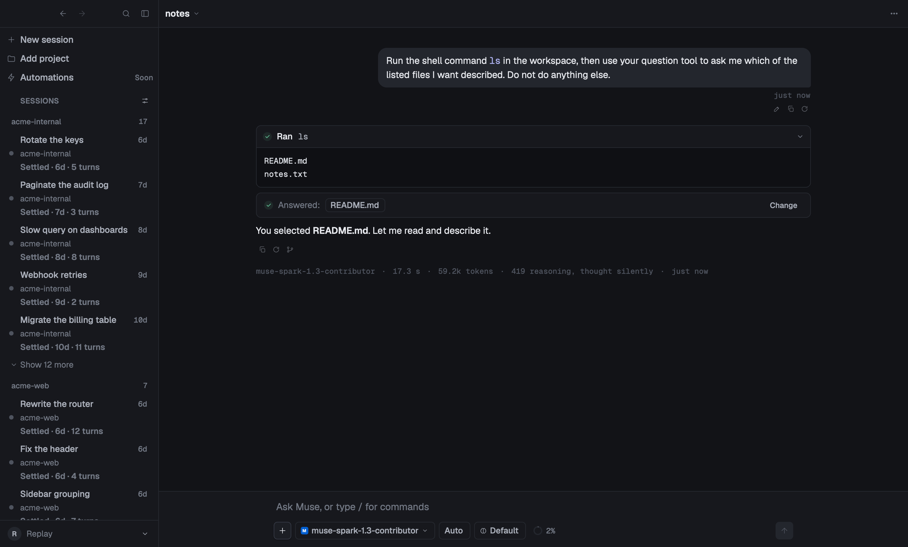
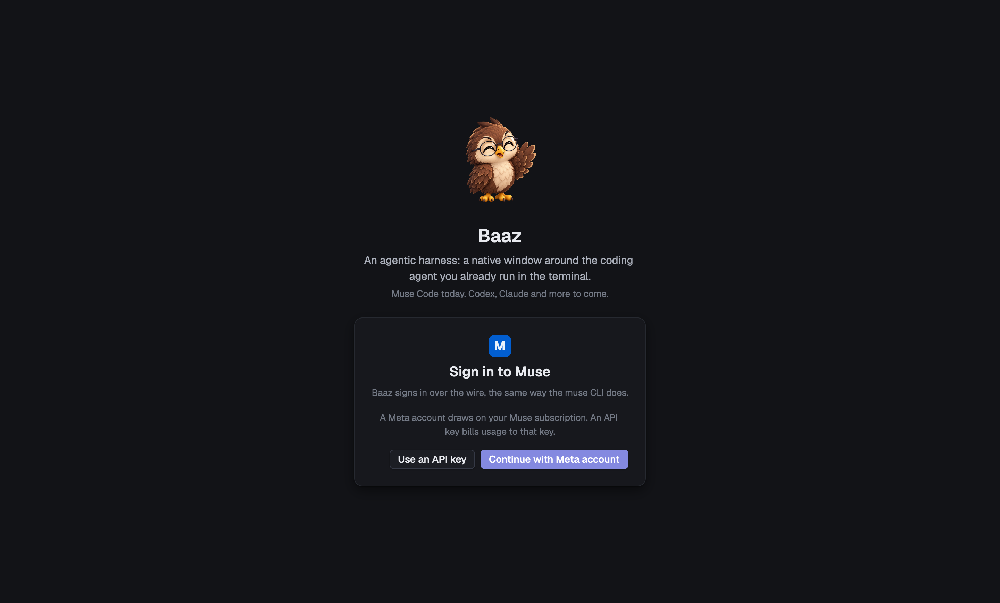
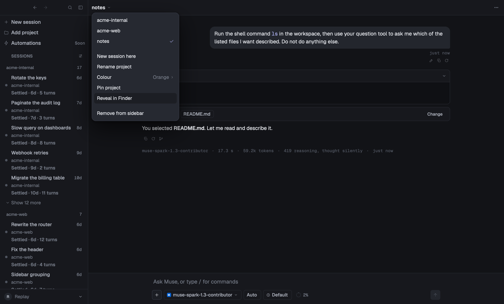
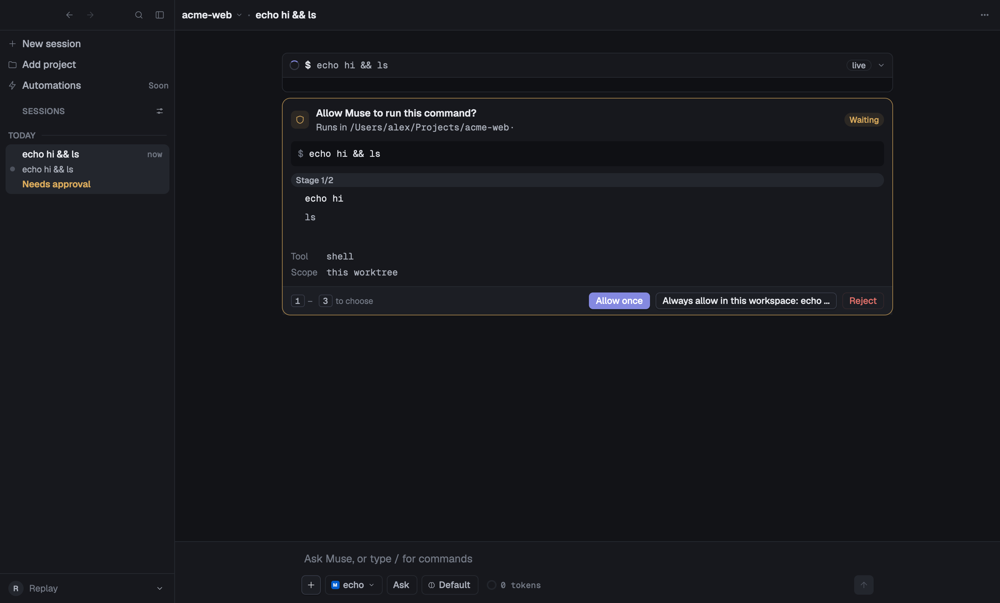
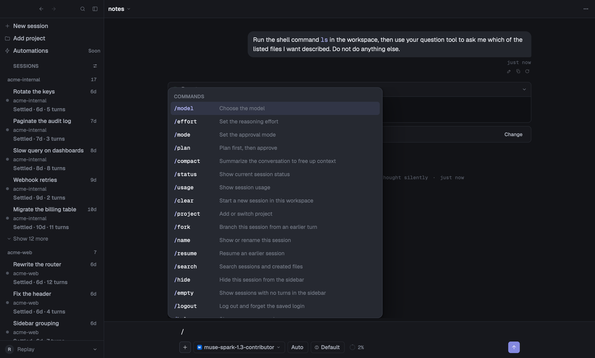
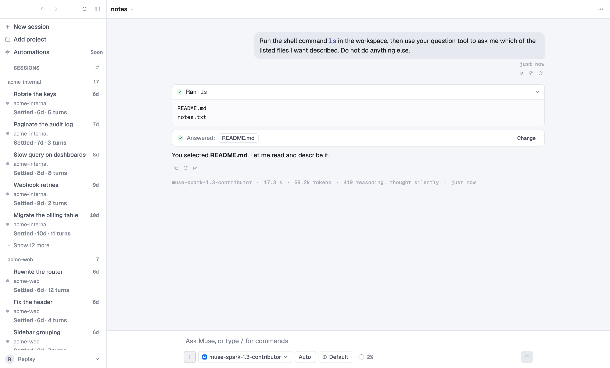
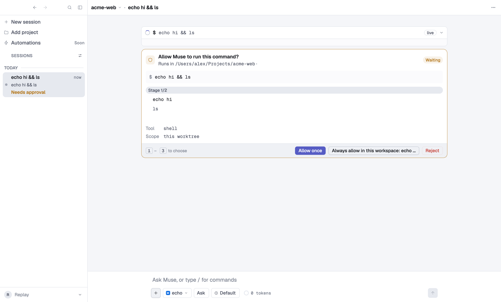

<div align="center">


# Baaz

**A native macOS window around Muse Code.**

The `muse` CLI ships a terminal UI. This is the same agent with a real
window around it — approvals, questions, plans, todos and tool output drawn
as interface rather than printed as text.

</div>



## What it does

- **Chat over Muse Code.** Drives `muse serve` as a child process and speaks
  MSP (JSON-RPC 2.0 as NDJSON over stdio); signs in the way the CLI does —
  a Meta account, or an API key.
- **A streaming transcript** with markdown, reasoning and tool calls folded
  into readable cards, per-turn token counts, a context meter with
  compaction, and a queue strip for steering a turn that is already running.
- **Approvals, questions and errors as real UI** — multi-stage approval
  cards carrying the server's own choices, question cards with previews and
  a timeout, error banners with retry.
- **Projects.** One window over several workspaces at once, grouped by
  project or by date, with per-project pinning, colour, and
  model/effort/approval defaults.
- **Sessions**: resume, rename, fork, archive. A draft — text, images,
  files — kept per project, and full-text search across transcripts.
- **A composer** with model, effort and mode menus, `@`-mentions,
  `/`-commands (including skills from `muse skills list`), prompt history
  and image attachments.
- **Billing-tier awareness.** Baaz probes which plan a login is on and warns
  *before* a turn would bill pay-as-you-go, rather than after the fact. See
  [Cost](#cost--read-this-first).
- Light and dark themes, a command palette, and a keyboard-first keymap.

## A walk through it

### 1. Sign in



Two ways in, and they bill differently: a **Meta account** draws on your Muse
subscription, an **API key** bills usage to that key. Baaz signs in over the
wire — the same `account/*` calls the CLI makes — and never keeps the
credential itself. That stays Muse's, in `~/.config/muse/auth.json`.

### 2. Start a session

Muse needs a folder for every session, so Baaz makes one: `~/baaz-sessions`,
created at first launch. You can ask something straight away, before
adopting anything; those sessions are grouped under **Unfiled**.

Add a project when you want a folder of your own. The sidebar then groups
every session by the project it belongs to, and new sessions there start
with that project's model, effort and approval defaults.



### 3. Answer an approval



When Muse asks to run something, the card carries **the server's own
choices** rather than a guess at them — allow once, always allow in this
workspace, reject — with the staged command, the tool, and the scope a
standing answer would apply to. Number keys pick. Until you answer, that
session's sidebar row reads `Needs approval`, so a question parked in
another project is never silently waiting.

### 4. Drive it from the keyboard



`/` for commands and skills, `@` to mention a file, `⌘K` for the palette,
`⌘F` to search transcripts. Every key is in
[`docs/08-keymap.md`](docs/08-keymap.md).

### Both themes, everywhere

<p>
  
  
</p>

> Every screenshot here is rendered from a checked-in wire capture by
> [`scripts/readme-shots.sh`](scripts/readme-shots.sh) — which is why the
> account row reads *Replay*. None of it is mocked up by hand, and running
> the script reproduces all of it.

## Requirements

- **macOS 14 (Sonoma) or later**
- **Rust 1.85+** and the Xcode command line tools (`xcode-select --install`)
- The **`muse` CLI** on your `PATH`, signed in to a Muse Code account.
  Baaz targets muse's 1.3.x wire schema (MSP).
- The [`aui`](https://github.com/latekaapi/agentic-ui) component library,
  checked out **beside** this repository — it is a path dependency for now
  (see `Cargo.toml`).

## Building and running

```sh
git clone https://github.com/latekaapi/baaz
git clone https://github.com/latekaapi/agentic-ui   # beside it, not inside it

cd baaz
cargo run -p baaz                                # workspace = $PWD
cargo run -p baaz -- --workspace ~/code/thing    # somewhere else
```

A distributable `.app` bundle:

```sh
scripts/bundle.sh                    # builds target/bundle/Baaz.app
open target/bundle/Baaz.app
```

## Cost — read this first

**There is no free provider.** `--provider echo` picks a *route*, not a
bill: on a signed-in machine anything that reaches `turn/start` spends a
turn, and what that costs depends on which plan the login is on. Muse issues
credentials on two tiers, and a pay-as-you-go token bills every turn as API
usage. Baaz probes the tier and warns before sending on that lane.

What costs nothing:

```sh
cargo run -p baaz -- --replay fixtures/msp/transcript-approve.jsonl   # a checked-in capture, no server at all
cargo run -p baaz -- --no-connect                                     # draws the chrome, no server
cargo run -p baaz -- --print-tier                                     # which plan is this login on?
```

[`docs/06-billing.md`](docs/06-billing.md) has the full picture, and
[`CONTRIBUTING.md`](CONTRIBUTING.md) the rest of the scripting surface —
`--steps`, `--screenshot`, and which step verbs spend a turn.

## How it is put together

```
crates/muse-client    the transport and the typed MSP schema
crates/muse-adapter   MuseFold: MSP events → aui_protocol deltas
crates/baaz           the gpui application
fixtures/msp          checked-in wire captures; every one of them replays
```

Every capture under `fixtures/msp/` is folded in the test suite and compared
against a snapshot, so this client's reading of the protocol is pinned by
real traffic rather than by the schema alone. `cargo test --workspace` never
spawns a server and never spends a turn.

| file | what it covers |
|---|---|
| [`docs/00-spec.md`](docs/00-spec.md) | the frozen spec: scope, decisions, phases and gates |
| [`docs/01-transport.md`](docs/01-transport.md) | MSP over stdio: framing, the handshake, reconnect |
| [`docs/02-app.md`](docs/02-app.md) | the application: entities, auth, the sidebar, the shell |
| [`docs/03-composer.md`](docs/03-composer.md) | the composer's controls, menus and pickers |
| [`docs/04-approvals.md`](docs/04-approvals.md) | approvals, questions, errors, `--replay` |
| [`docs/06-billing.md`](docs/06-billing.md) | the two credential tiers, the probe, the send guard |
| [`docs/07-architecture.md`](docs/07-architecture.md) | the crates, the thread model and the fold |
| [`docs/08-keymap.md`](docs/08-keymap.md) | every key, as built |
| [`docs/10-msp-1.1.1-diff.md`](docs/10-msp-1.1.1-diff.md) | the MSP schema diff this client tracks |
| [`docs/12-projects.md`](docs/12-projects.md) | the projects feature: design and data model |
| [`docs/12-search.md`](docs/12-search.md) | full-text search: storage and indexing |
| [`CHANGELOG.md`](CHANGELOG.md) | what is in this release |

## Status

Pre-1.0, macOS only. The wire protocol is versioned by the `muse` CLI
itself; this client tracks its 1.3.x schema and may need updating against a
newer or older `muse`. Expect rough edges.

## License

MIT — see [`LICENSE`](LICENSE).

## Credits

Built on [gpui](https://www.gpui.rs) — the UI framework behind
[Zed](https://zed.dev) — the `gpui-kit` component kit, and the `aui`
component library (which uses [Geist](https://vercel.com/font) fonts).
Talks to [Muse Code](https://github.com/facebookresearch/muse) from Meta.
